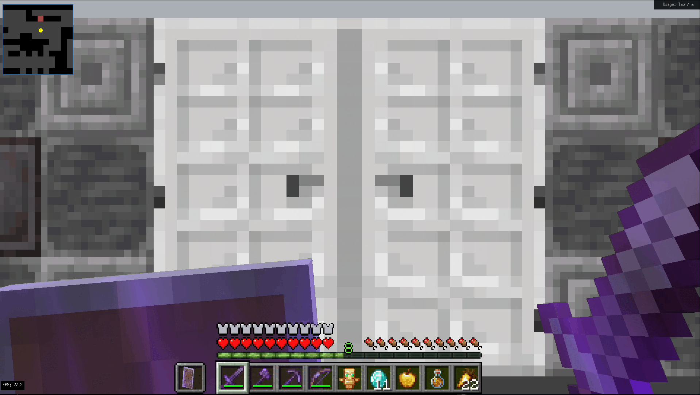
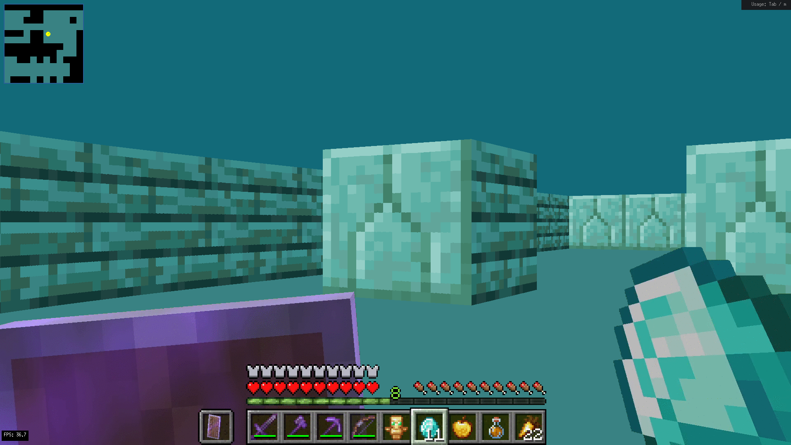
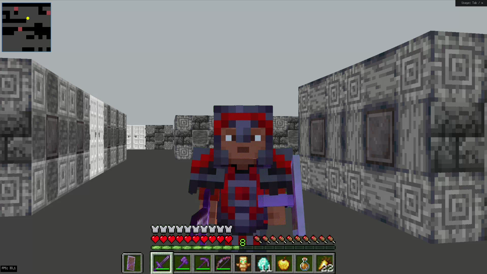
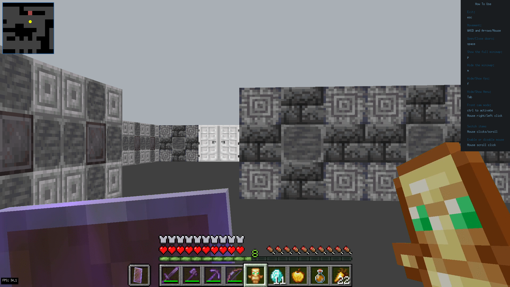

# Cub3D

Cub3D is a **42 School** team project that recreates a **dynamic 3D view inside a maze** using the [**MiniLibX**](https://github.com/42Paris/minilibx-linux) graphics library. It implements **raycasting**, similar to the classic game [**Wolfenstein 3D**](http://users.atw.hu/wolf3d/), the first true **First-Person Shooter (FPS)** in video game history.

## 🎮 Features
- **Raycasting engine** similar to Wolfenstein 3D
- **MiniLibX-based rendering** a simple X-Window (X11R6) programming API in C
- **Textured walls** inspired by Minecraft
- **Configurable maps** with textures and colors
- **Player movement & interaction**

## 🖥️ Installation
### Prerequisites
- A Linux or macOS system
- `make`, `gcc`, and necessary dependencies for **MiniLibX**

### Steps
1. Clone the repository:
   ```sh
   git clone https://github.com/eel-brah/CUB3D.git
   cd CUB3D
   ```
2. Compile the project:
   ```sh
   make
   ```

## 🚀 Usage
Run the compiled program with a map file:
```sh
./cub3d maps/m.cub
```

### Controls
| Action             | Key |
|--------------------|-----|
| Move Forward      | W   |
| Move Backward     | S   |
| Strafe Left       | A   |
| Strafe Right      | D   |
| Look Left/Right   | Arrow Keys / Mouse |
| Open/Close Doors  | Space |
| Show/Hide Minimap | M / P |
| Show/Hide FPS     | F   |
| Toggle Menu       | Tab |
| Switch Items      | Mouse Click / Scroll |
| Enable/Disable Mouse | Scroll Click |

## 🗺️ Map Format
A sample map file (`.cub`) contains texture paths and floor/ceiling colors followed by a **grid-based** layout:
```
NO ./path_to_the_north_texture
SO ./path_to_the_south_texture
WE ./path_to_the_west_texture
EA ./path_to_the_east_texture

F 220,100,0
C 225,30,0

1111111111111111111111111
1000000000110000000000001
1011000001110000000000001
1001000000000000000000001
111111111011000001110000000000001
...
```

## 📸 Showcase
### In-Game View



### Cam View


### Menu 


## 📜 License
This project is part of the **42 School curriculum** and is intended for educational purposes.

## 👥 Authors
- [GitHub Profile](https://github.com/eel-brah)
- [GitHub Profile](https://github.com/AhmedMokhtari)

